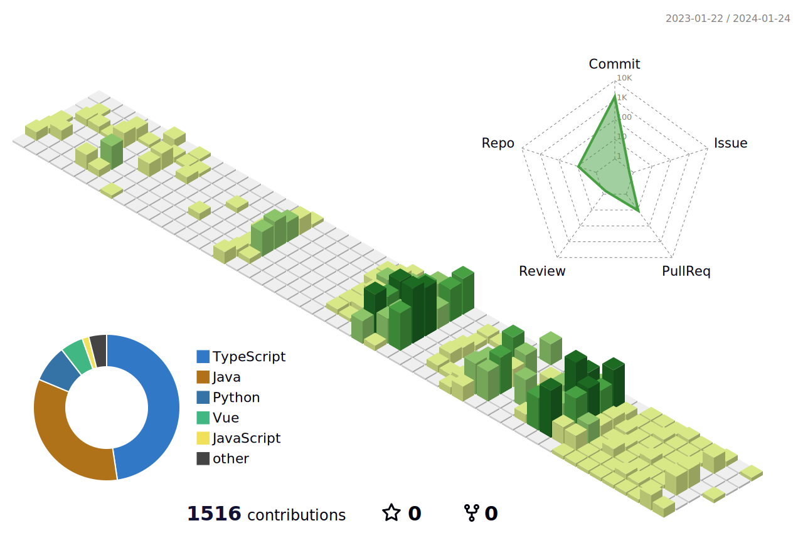

<h1>LEE SEONG MIN 🌱</h1>

  
  

  <h2>💪 Skills</h2>
    
  
  
  
  
  
   
  
  
  
  
  
  
   
  
  
  

  <h2>🛠️ Tools</h2>

  
  
  
  
    
  

   

  <h2>💻 Algorithm</h2>
  
 
  

  
  

## 🌱 Git Status

